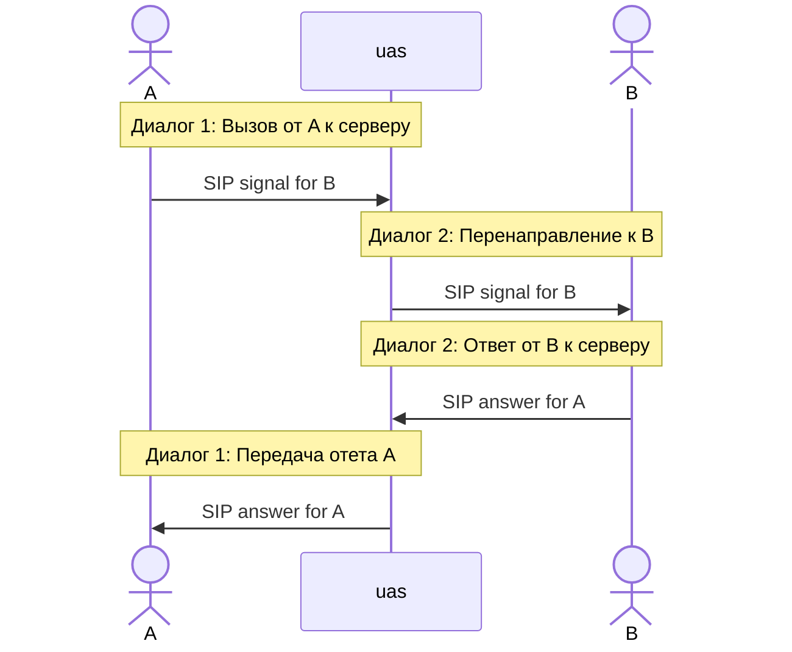
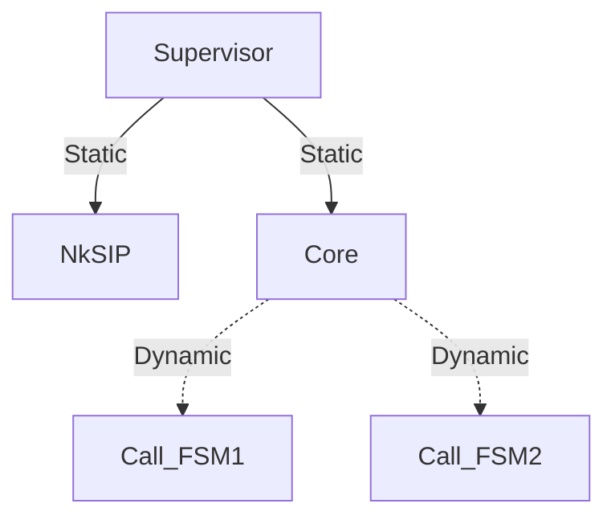
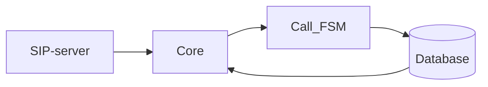

voip_server
=====

An OTP application

Build
-----

    $ rebar3 compile

<!-- https://mermaid.js.org/syntax/sequenceDiagram.html -->

<!-- https://mermaid.js.org/syntax/sequenceDiagram.html -->

<!-- https://mermaid.js.org/syntax/sequenceDiagram.html -->

